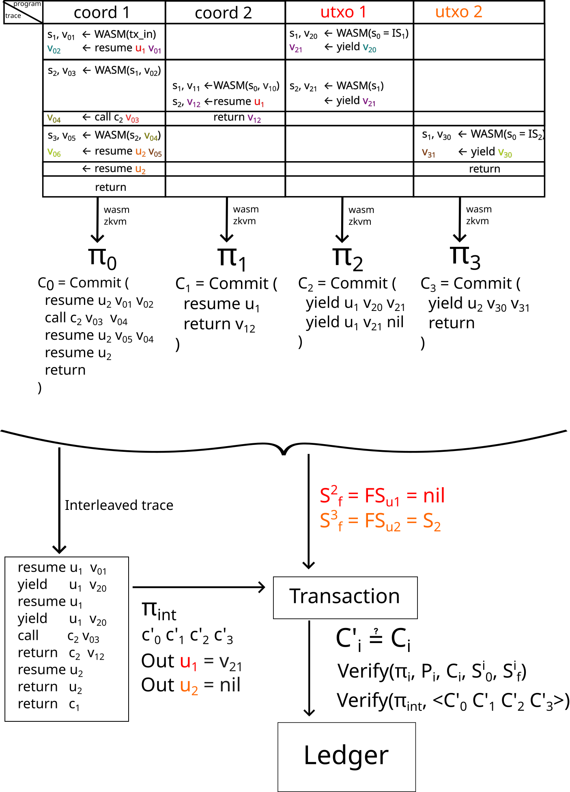

## About

This package implements a standalone circuit for the Starstream interleaving proof.

### Architecture

Let's start by defining some context. A Starstream transaction describes
coordinated state transitions between multiple concurrent on-chain programs,
where each transition is analogous to consuming a utxo. Each program is modelled
as a coroutine, which is a resumable function. Resuming a utxo is equal to
consuming it. Yielding from the utxo is equivalent to creating a new utxo.

The ledger state for a program (utxo) is described by:

1. A coroutine state. Which includes a program counter (to know from where to
resume the execution), and the values of variables in the stack.
2. The value of the last yield.

The programs are represented as WASM modules, although the actual ISA does
not matter here. A program can either do native WASM operations, which for the
purposes of the interleaving verification is just a blackbox, or it can interact
with other programs.

A program is either:

1. A coordination script. Which doesn't have state persisted in the ledger.
2. A utxo, which has persistent state.

Coordination scripts can call into utxos with some id, or other coordination
scripts (here the id can just be source code). Utxos can only yield.

Coordination scripts calling into each other is equivalent to plain coroutine
calls.

Yielding doesn't necessarily changes control flow to the coordination script
that called resume, because the transaction may end before that, and the next
coordination script could be a different one. Also because we have algebraic
effect handlers, control flow may go to a coordination script that was deeper in
the call stack.

As mentioned before, programs are modelled as WASM programs, both in the case
of coordination scripts and in the case of utxos. Inter-program communication is
expressed as WASM host (imported) function calls. To verify execution, we use a
*WASM zkVM*. When proving, the only thing we assume about host calls is that the
only memory modified by it is that expressed by the function signature.

This means we can think of a program trace as a list of native operations with
interspersed blackbox operations (which work as lookup arguments).

From the program trace, we can use the zkVM to make a zero knowledge that claims
that.

1. The ISA instructions were executed in accordance with the WASM ISA rules.
2. Host calls interact with the stack according to function types.

What a single proof doesn't claim is that the values returned by host calls
were correct.

In the case of lookup arguments for the optimizations (e.g. witnesses for
division, sorting), this can be extended by adding some verification of the
returned values. This spec doesn't focus on this specific case.

The case that matters for this spec is the case where the host call is supposed
to trigger a change in ledger state and get some value from another program.

The basic ledger operations that we care about are:

#### Coordination script

- resume(utxo: UtxoHandle, value: Value) -> Value

Changes control flow from the coordination script to the utxo. The `value`
argument needs to match the return value of the last `yield` in that program.

- new(utxo: ProgramId, value: Value) -> UtxoHandle

Creates a new entry in the utxo set in the ledger state. It registers the
`ProgramId`, which acts as a verification key, and sets the initial coroutine
state.

#### UTXO

- yield(value: Value) -> Value

Pause execution of the current utxo and move control flow to a coordination
script. This creates a new utxo entry, with the PC = current pc and the
coroutine state with the current variables.

- burn()

Explicit drop in the utxo's program. This removes the program (and the coroutine
state) from the ledger state.

##### Tokens

- bind(token: TokenHandle)
- unbind(token: TokenHandle)

Relational arguments. The ledger state has to keep relations of inclusion, where
tokens can be included in utxos.

#### Shared memory

- share(value: Value) -> DataHandle
- get(value: DataHandle) -> Value

`DataHandle` is a type used to represent channel-like shared memory. This is
needed to implement effect handlers, since it requires sharing data across
different memory environments.

In this case `Value` it's just a placeholder for any value that can be
represented in the Starstream type system and that can be shared across programs
(the language doesn't have pointers, so this should be almost any type).

A `UtxoHandle` is an identifier of a ledger state entry. Which is associated
with a specific program (the source code), and its current state.

A `ProgramId` is an identifier of the source code (a verification key).

### Proving

All the operations that use the ledger state are communication operations. And
can be thought of as memory operations. Taking inspiration from offline memory
checking (and Nebula), we can bind each proof to an incremental commitment to
all the ledger operations in the current transaction.

Let's say we have a coordination script, and after execution we get a trace like:

```
wasm_op_x
r1 <- call resume utxo_id v1
wasm_op_y
r2 <- call resume utxo_id v2
wasm_op_z
```

We use the zkVM and we get a proof of that execution. And also the proof is
bound to an incremental commitment `C_coord_comm := Commit(resume, v2, r2) +
Commit(resume, v1, r1)`.

The straight forward construction for this is by using iterative hashing, for
example with Poseidon. For example: `H(<resume, v2, r2>, H(<resume, v1, r1>,
<nop, 0, 0>)`.

To reduce the amount of hashing required, a more efficient construction would be
to combine a hash function with a vector commitment scheme, reducing the hashing
needed to one per operation.

Note that we also need to include a tag for the operation in the commitment,
since that fixes the order of operations.

Now let's say we have the trace of the utxo that gets resumed. It forms a
dual or complement with the coordination script trace. Where a yield is dual
to resume:

```
wasm_op_a
z1 <- call yield y1
wasm_op_b
z2 <- call yield y2
wasm_op_c
```

Then we bind the zkVM wasm proof to a different commitment:

`C_utxo_comm := Commit(yield, y2, z2) + Commit(resume, y1, y1)`

Then we can generate a new trace with the _actual_ interleaving defined by
the functional dependency, by combining both executions into the right order
of interleaving:

```
resume utxo:utxo_id in:v1 out:r1
yield  utxo:utxo_id in:y1 out:z1
resume utxo:utxo_id in:v2 out:r2
yield  utxo:utxo_id in:y2 out:z2
```

Then we need to prove the following things:

1. The exchange of messages match.

In this case this means that all of these hold:

  - `v1 == z1`
  - `r1 == y1`
  - `v2 == z2`
  - `r2 == y2`

2. The exchanged values match the ones in the individual original traces.

For this we get a single proof, and two commitments: 

- `C_coord_coom'`
- `C_utxo_coom'`

Then the verifier can check that the commitments match the ones from the
original proofs. This also enforces the same order of operations (and values) in
both (or all n in general) proofs.

3. The order matches the ids. That is, a resume to a certain utxo_id must match
the id of the utxo that yields in the next step.

*Note*: The interleaving proof doesn't need to know about the coroutine states,
just about the values of yield and resume.

### Example

As a more general example, let's say we have two coordination scripts and two utxos.

```
fn coord1(input: Data, u1: Utxo1, u2: Utxo2) {
  let v_01 = f(input);
  let v_02 = resume u1 v_01;

  let v_03 = g(v_03);

  let v_04 = coord2(v_03);

  let v_05 = h(v_04);
 
  let v_06 = resume u_2 v_05;
  resume u2 nil;

  return;
}

fn coord2(u1: Utxo1, v_10: u32) {
  let v_11 = f(v_10);
  let v_12 = resume u1;
  return v_12;
}

utxo Utxo1 {
  main {
    // current state
    yield;

    yield v_20;
    yield v_21;
  }
}

utxo Utxo2 {
  main {
    // current state
    yield;

    let v_31 = yield v_30;
    return;
  }
}
```

The flow of execution to proving then looks something like this:

Note: WASM is an arbitrary trace of wasm opcodes from the corresponding program.


